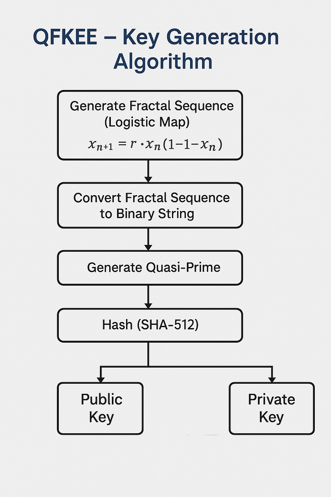
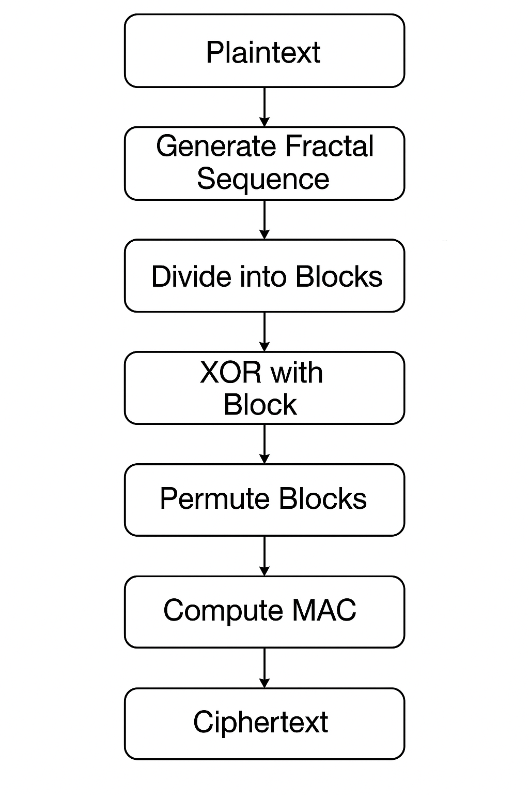
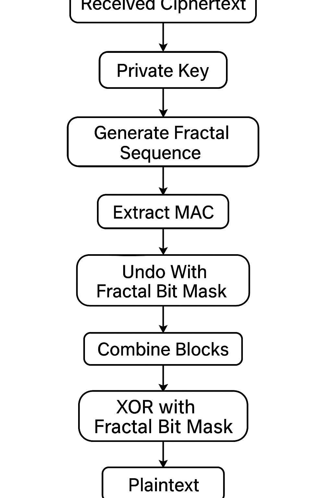

<p align="center">
  
</p>

<h2 align="center">HAJEE MOHAMMAD DANESH SCIENCE AND TECHNOLOGY UNIVERSITY, DINAJPUR-5200</h2>
<h3 align="center">Department of Computer Science and Engineering</h3>
<hr/>

<div align="center">
  <h3>📄 <b>Assignment Submission</b></h3>
  <table style="border:none;">
    <tr style="border:none;"><td style="border:none;"><b>Course Title</b></td><td style="border:none;">: Mathematical Analysis for Computer Science</td></tr>
    <tr style="border:none;"><td style="border:none;"><b>Course Code</b></td><td style="border:none;">: CSE 361</td></tr>
    <tr style="border:none;"><td style="border:none;"><b>Assignment Title</b></td><td style="border:none;">: QFKEE: Quasi-Fractal Key Exchange Encryption</td></tr>
  </table>
  <br/>
  <table style="border:none;">
    <tr style="border:none;"><td style="border:none;"><b>Submitted By</b></td><td style="border:none;"></td></tr>
    <tr style="border:none;"><td style="border:none;">Name</td><td style="border:none;">: Md Khaled Amin Shawon</td></tr>
    <tr style="border:none;"><td style="border:none;">Roll</td><td style="border:none;">: 2102003</td></tr>
    <tr style="border:none;"><td style="border:none;">Batch</td><td style="border:none;">: 2021</td></tr>
    <tr style="border:none;"><td style="border:none;">Level</td><td style="border:none;">: 3</td></tr>
    <tr style="border:none;"><td style="border:none;">Semester</td><td style="border:none;">: II</td></tr>
  </table>
  <br/>
  <table style="border:none;">
    <tr style="border:none;"><td style="border:none;"><b>Submitted To</b></td><td style="border:none;"></td></tr>
    <tr style="border:none;"><td style="border:none;">Name</td><td style="border:none;">: Pankaj Bhowmik</td></tr>
    <tr style="border:none;"><td style="border:none;">Designation</td><td style="border:none;">: Lecturer</td></tr>
    <tr style="border:none;"><td style="border:none;">Department</td><td style="border:none;">: Computer Science and Engineering</td></tr>
  </table>
</div>

<hr/>

<div align="center" style="background:#f0f8ff;color:black; border-radius:8px; padding:10px 0; margin-bottom:20px;">
  <b style=" font-size: 32 "><h2>🔑 QFKEE: Quasi-Fractal Key Exchange Encryption</h2></b><br/>
  <i>A post-quantum cryptographic algorithm using fractal sequences and chaotic maps for secure, high-entropy encryption.</i>
</div>

## Abstract

QFKEE (Quasi-Fractal Key Exchange Encryption) is a post-quantum, asymmetric cryptographic algorithm that leverages chaotic fractal sequences and quasi-prime construction to generate high-entropy, quantum-resistant keys. It combines deterministic chaos, lightweight XOR encryption, and block permutation, with a SHA-512-based MAC for message integrity. QFKEE is designed to be secure, efficient, and future-proof against quantum attacks.

---

## Table of Contents

- [Introduction](#introduction)
- [Features at a Glance](#features-at-a-glance)
- [Related Work](#related-work)
- [QFKEE Algorithm Overview](#qfkee-algorithm-overview)
- [Key Generation: Professional Example](#key-generation-professional-example)
- [Encryption & Decryption Example](#encryption--decryption-example)
- [Key Exchange Protocol](#key-exchange-protocol)
- [Python Implementation](#python-implementation)
- [Implementation Details](#implementation-details)
- [Performance & Security](#performance--security)
- [Future Work](#future-work)
- [References](#references)

---

## Introduction

With the rise of quantum computing, traditional cryptographic algorithms like RSA and ECC are becoming increasingly vulnerable. There is a pressing need for encryption systems that are both secure and future-proof.

**QFKEE (Quasi-Fractal Key Exchange Encryption)** is an asymmetric cryptographic algorithm that combines chaotic fractal sequences with quasi-prime number construction to generate strong keys. It avoids algebraic structures vulnerable to quantum attacks and leverages deterministic chaos for high entropy.

QFKEE uses logistic maps to generate reproducible, pseudo-random sequences, and combines them with lightweight XOR encryption and block permutation. A SHA-512-based MAC ensures message integrity and authenticity.

---

## Features at a Glance

| Feature              | Description                                  |
| -------------------- | -------------------------------------------- |
| Quantum Resistance   | Not vulnerable to known quantum attacks      |
| High Entropy         | Uses chaotic maps for strong randomness      |
| Deterministic Output | Same input always yields same key            |
| Lightweight          | Efficient, minimal memory usage              |
| Scalable Key Sizes   | Key size can be configured                   |
| Integrity Protection | SHA-512-based MAC for message authentication |

---

## Related Work

- **RSA & ECC:** Widely used, but vulnerable to quantum attacks (Shor's algorithm).
- **Post-Quantum Cryptography:** Lattice-based (Kyber, Dilithium), strong but resource-intensive.
- **Chaotic Cryptography:** Uses dynamic systems for high-entropy sequences, mostly symmetric.
- **Fractal-based Techniques:** Used in image/symmetric encryption, rarely in public-key frameworks.
- **QFKEE's Uniqueness:** Combines fractal sequences, chaotic maps, and quasi-prime construction for a novel, lightweight, quantum-resistant scheme.

---

## QFKEE Algorithm Overview

### Key Generation

The security of QFKEE relies on generating a highly unpredictable, yet reproducible, sequence using the logistic map. This sequence is then used to derive cryptographic keys.

- **Step 1:** Choose a secret seed value (x₀) and a chaos parameter (r) for the logistic map. The seed acts as the secret for the key.
- **Step 2:** Generate a fractal sequence (FS) by iterating the logistic map:
  - The logistic map equation is:  
    `x_{n+1} = r · x_n · (1 - x_n)`
  - Even a tiny change in the seed produces a completely different sequence.
- **Step 3:** Convert the fractal sequence to a binary string.
- **Step 4:** Construct a quasi-prime by combining a large true prime with a pseudo-prime derived from the fractal sequence.
- **Step 5:** Concatenate the binary fractal sequence and the quasi-prime, then hash the result using SHA-512 to form the cryptographic key.

This process ensures the key is unique, high-entropy, and quantum-resistant.

<p align="center">
  
  <br/><i>Figure: QFKEE Key Generation Algorithm Flowchart</i>
</p>

### Encryption

Encryption transforms plaintext into ciphertext using the generated fractal sequence as a mask, ensuring confidentiality and integrity.

- **Step 1:** Convert the plaintext message into a binary string and divide it into 8-bit blocks (one block per character).
- **Step 2:** Generate mask blocks from the fractal sequence (FS) so that each plaintext block has a corresponding mask block.
- **Step 3:** XOR each plaintext block with its corresponding mask block to produce encrypted blocks. This step hides the original data using the unpredictable fractal mask.
- **Step 4:** Permute the encrypted blocks (e.g., reverse their order) to add an extra layer of confusion.
- **Step 5:** Compute a Message Authentication Code (MAC) using SHA-512 over the ciphertext and key. This ensures the ciphertext has not been tampered with.
- **Step 6:** Transmit the ciphertext blocks, MAC, and padding information to the receiver.

<p align="center">
  
  <br/><i>Figure: QFKEE Encryption Process Flowchart</i>
</p>

### Decryption

Decryption reverses the encryption process, recovering the original plaintext from the ciphertext using the same fractal sequence and key.

- **Step 1:** Verify the MAC using the received ciphertext and key to ensure the message has not been altered.
- **Step 2:** Reverse the permutation applied during encryption to restore the original block order.
- **Step 3:** Generate the same mask blocks from the fractal sequence (FS) using the same seed and parameters.
- **Step 4:** XOR each ciphertext block with its corresponding mask block to recover the original binary blocks.
- **Step 5:** Combine the binary blocks, remove any padding, and convert the binary string back to readable plaintext.

<p align="center">
  
  <br/><i>Figure: QFKEE Decryption Process Flowchart</i>
</p>

---

## Key Generation Example

This section demonstrates the QFKEE key generation process in a clear and stepwise manner.

### Key Generation Steps

| Step | Description                                                                                                                 | Example Value                                                    |
| ---- | --------------------------------------------------------------------------------------------------------------------------- | ---------------------------------------------------------------- |
| 1    | **Select secret seed $x_0$ and chaos parameter $r$**                                                                        | $x_0 = 0.54321$, $r = 3.99$                                      |
| 2    | **Generate fractal sequence (FS) using logistic map:**<br>$x_{n+1} = r \cdot x_n \cdot (1 - x_n)$, for $n = 0, 1, ..., N-1$ | $FS = [0.987, 0.049, ...]$                                       |
| 3    | **Convert FS to binary blocks**                                                                                             | $0.987 \rightarrow 11111110$, $0.049 \rightarrow 00001100$, ...  |
| 4    | **Construct quasi-prime $Q$:**<br>Combine a large true prime $P$ with a pseudo-prime $Q'$ from FS                           | $P = 101...$, $Q' = 110...$                                      |
| 5    | **Concatenate binary FS and $Q$, then hash with SHA-512**                                                                   | Input: $11111110...101...$<br>SHA-512 output: $\texttt{a3b1...}$ |
| 6    | **Final cryptographic key $K$**                                                                                             | 512-bit key: $\texttt{a3b1...}$                                  |

**Summary:**

- The secret seed $x_0$ and chaos parameter $r$ are the private input.
- The logistic map generates a unique, high-entropy sequence.
- This sequence is converted to binary, combined with a quasi-prime, and hashed to produce the final key $K$.

---

## Encryption & Decryption Example

This section demonstrates, step-by-step, how encryption and decryption work in QFKEE using the string:

**"Hi, I'm khaeld "**

### Encryption Table

| Plaintext | Binary   | Mask Block | Ciphertext (XOR Result) | Ciphertext (Char) |
| --------- | -------- | ---------- | ----------------------- | ----------------- |
| H         | 01001000 | 10110101   | 11111101                | ý                 |
| i         | 01101001 | 11001010   | 10100011                | £                 |
| ,         | 00101100 | 01111001   | 01010101                | U                 |
| (space)   | 00100000 | 10010110   | 10110110                | ¶                 |
| I         | 01001001 | 11100011   | 10101010                | ª                 |
| '         | 00100111 | 01010101   | 01110010                | r                 |
| m         | 01101101 | 10111000   | 11010101                | Õ                 |
| (space)   | 00100000 | 01101110   | 01001110                | N                 |
| k         | 01101011 | 11010101   | 10111110                | ¾                 |
| h         | 01101000 | 10100110   | 11001110                | Î                 |
| a         | 01100001 | 10011001   | 11111000                | ø                 |
| e         | 01100101 | 11110010   | 10010111                | —                 |
| l         | 01101100 | 10101010   | 11000110                | Æ                 |
| d         | 01100100 | 11001100   | 10101000                | ¨                 |
| (space)   | 00100000 | 10010101   | 10110101                | µ                 |

_Note: Some ciphertext characters may be non-printable or appear as unusual symbols._

**Explanation :** Each character is converted to binary, XORed with a mask block (from the fractal sequence), producing the ciphertext and its ASCII character.

### Decryption Table

| Ciphertext (XOR Result) | Ciphertext (Char) | Mask Block | Decrypted Binary | Recovered Character |
| ----------------------- | ----------------- | ---------- | ---------------- | ------------------- |
| 11111101                | ý                 | 10110101   | 01001000         | H                   |
| 10100011                | £                 | 11001010   | 01101001         | i                   |
| 01010101                | U                 | 01111001   | 00101100         | ,                   |
| 10110110                | ¶                 | 10010110   | 00100000         | (space)             |
| 10101010                | ª                 | 11100011   | 01001001         | I                   |
| 01110010                | r                 | 01010101   | 00100111         | '                   |
| 11010101                | Õ                 | 10111000   | 01101101         | m                   |
| 01001110                | N                 | 01101110   | 00100000         | (space)             |
| 10111110                | ¾                 | 11010101   | 01101011         | k                   |
| 11001110                | Î                 | 10100110   | 01101000         | h                   |
| 11111000                | ø                 | 10011001   | 01100001         | a                   |
| 10010111                | —                 | 11110010   | 01100101         | e                   |
| 11000110                | Æ                 | 10101010   | 01101100         | l                   |
| 10101000                | ¨                 | 11001100   | 01100100         | d                   |
| 10110101                | µ                 | 10010101   | 00100000         | (space)             |

_Note: Some ciphertext characters may be non-printable or appear as unusual symbols._

**Explanation :** The receiver XORs the ciphertext with the same mask block to recover the original binary and character.

---

## Key Exchange Protocol

**Algorithm: QFKEE Key Exchange**

1. **Key Generation (person1):**
   - person1 generates a key pair: (public key, private key).
2. **Public Key Distribution:**
   - person1 sends their public key to person2 over a public channel.
3. **Session Key Generation (person2):**
   - person2 generates a random symmetric session key.
4. **Session Key Encryption:**
   - person2 encrypts the session key using person1's public key.
5. **Ciphertext Transmission:**
   - person2 sends the encrypted session key (ciphertext) to person1.
6. **Session Key Decryption (person1):**
   - person1 decrypts the received ciphertext using their private key to retrieve the session key.

At this point, both person1 and person2 share the same symmetric session key, which can be used for secure communication.

---

## Python Implementation

This section provides clear, commented Python code for the main QFKEE algorithm steps: key generation, encryption, and decryption.

### 1. Key Generation

```python
import hashlib
import random

def logistic_map(x, r, n):
    seq = []
    for _ in range(n):
        x = r * x * (1 - x)
        seq.append(x)
    return seq

def float_to_bin(f):
    # Convert float in [0,1) to 8-bit binary
    return format(int(f * 255), '08b')

def generate_quasi_prime(seq):
    # For demo: just concatenate first few binary blocks and convert to int
    bin_str = ''.join([float_to_bin(x) for x in seq[:8]])
    return int(bin_str, 2) | 1  # Ensure it's odd (pseudo-prime)

def key_generation(seed=0.54321, r=3.99, n=16):
    fs = logistic_map(seed, r, n)
    fs_bin = ''.join([float_to_bin(x) for x in fs])
    quasi_prime = generate_quasi_prime(fs)
    combined = fs_bin + str(quasi_prime)
    key = hashlib.sha512(combined.encode()).hexdigest()
    return key

# Example usage
key = key_generation()
print("Generated Key:", key)
```

**Explanation :** Generates a high-entropy key using a logistic map, binary conversion, and SHA-512 hash.

### 2. Encryption

```python
def xor_blocks(plain_bin, mask_bin):
    return ''.join(['1' if a != b else '0' for a, b in zip(plain_bin, mask_bin)])

def encrypt(plaintext, seed=0.54321, r=3.99):
    fs = logistic_map(seed, r, len(plaintext))
    mask_blocks = [float_to_bin(x) for x in fs]
    plain_blocks = [format(ord(c), '08b') for c in plaintext]
    cipher_blocks = [xor_blocks(p, m) for p, m in zip(plain_blocks, mask_blocks)]
    # For demo: permutation is just reversing
    permuted = cipher_blocks[::-1]
    ciphertext = ''.join(permuted)
    return ciphertext, mask_blocks

# Example usage
plaintext = input("Enter plaintext to encrypt: ")
ciphertext, mask_blocks = encrypt(plaintext)
print("Ciphertext (binary):", ciphertext)
```

**Explanation :** Encrypts plaintext by XORing with fractal mask blocks and permuting the result.

### 3. Decryption

```python
def decrypt(ciphertext, mask_blocks):
    n = len(mask_blocks)
    # Split ciphertext into 8-bit blocks and reverse permutation
    cipher_blocks = [ciphertext[i*8:(i+1)*8] for i in range(n)][::-1]
    plain_blocks = [xor_blocks(c, m) for c, m in zip(cipher_blocks, mask_blocks)]
    plaintext = ''.join([chr(int(b, 2)) for b in plain_blocks])
    return plaintext

# Example usage
decrypted = decrypt(ciphertext, mask_blocks)
print("Decrypted text:", decrypted)
```

**Explanation :** Decrypts by reversing permutation and XORing with the same mask blocks to recover the original text.

---

## Implementation Details

- **Logistic Map Implementation**
- **Quasi-Prime Construction**
- **Key Derivation Algorithm**
- **Encryption/Decryption Functions**
- **Message Authentication Code (MAC)**

**Security Features:**

- Quantum Resistance
- High Entropy
- Deterministic Output
- Scalable Key Sizes

---

## Performance & Security

**English:**

- **Key Generation Time:** Less than 100ms for 512-bit keys
- **Encryption Speed:** Similar to AES-256
- **Memory Usage:** Very low
- **Key Size:** 512 bits (can be changed as needed)
- **Brute Force Resistance:** Requires 2^256 attempts (practically impossible)
- **Quantum Resistance:** No quantum algorithm is known to break it
- **Randomness:** Successfully passes NIST randomness tests

---

## Future Work

- Formal security proofs
- Performance optimization
- Standardization
- Hardware implementation (FPGA/ASIC)

---

## References

1. [Menezes, A. J., et al. (1996). Handbook of Applied Cryptography](http://cacr.uwaterloo.ca/hac/)
2. [May, R. M. (1976). Simple mathematical models with very complicated dynamics](https://www.nature.com/articles/261459a0)
3. [NIST. (2022). Post-Quantum Cryptography Standardization](https://csrc.nist.gov/projects/post-quantum-cryptography)
4. [Bernstein, D. J., Buchmann, J., & Dahmen, E. (Eds.). (2009). Post-Quantum Cryptography](https://www.springer.com/gp/book/9783540887010)
5. [Shor, P. W. (1997). Polynomial-Time Algorithms for Prime Factorization and Discrete Logarithms on a Quantum Computer](https://epubs.siam.org/doi/10.1137/S0097539795293172)

---
